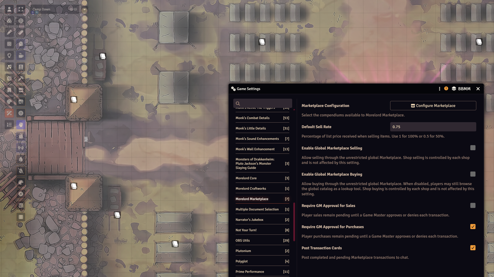
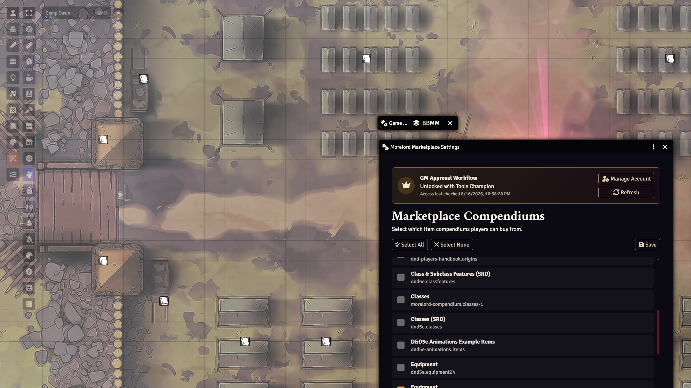
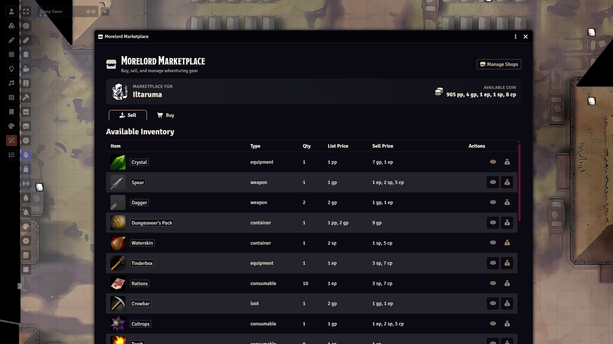
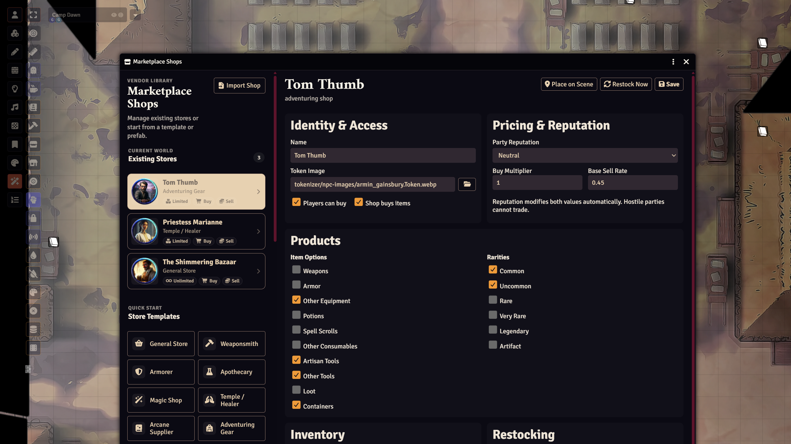
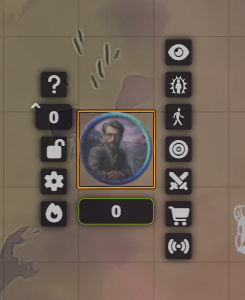
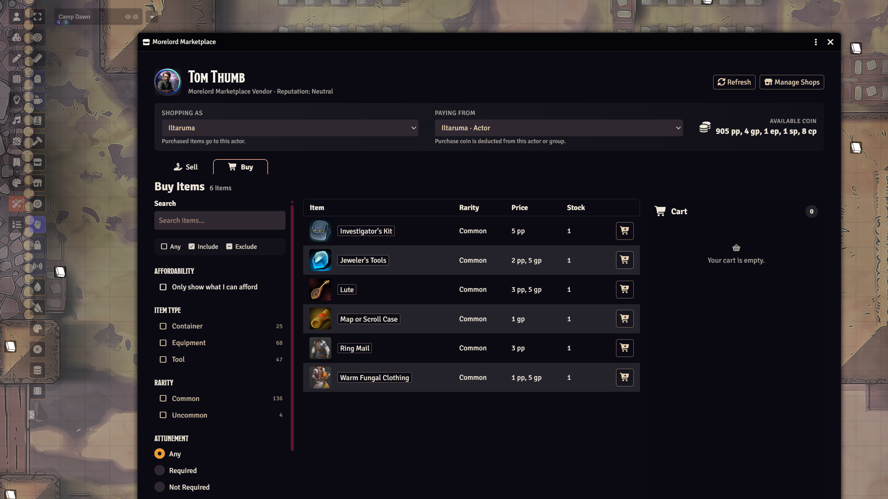
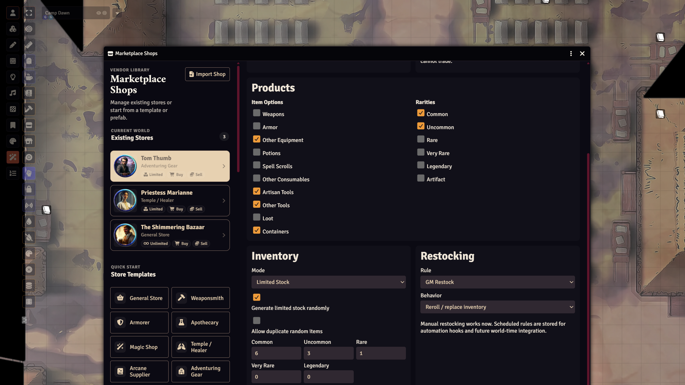

# Morelord Marketplace Game Master Manual

Morelord Marketplace gives a Foundry VTT world a global catalog for buying and selling dnd5e items. With Tools Premium or Tools Champion access, it also provides GM transaction approvals and Shop Manager for configurable scene vendors.

This manual applies to Morelord Marketplace 0.5.2, Foundry VTT v14, and the dnd5e system.

## Contents

- [Feature access](#feature-access)
- [Install and activate](#install-and-activate)
- [Configure the global Marketplace](#configure-the-global-marketplace)
- [Open and test the Marketplace](#open-and-test-the-marketplace)
- [Manage GM approvals](#manage-gm-approvals)
- [Set up premium access](#set-up-premium-access)
- [Create and configure shops](#create-and-configure-shops)
- [Place and operate scene shops](#place-and-operate-scene-shops)
- [Manage stock and restocking](#manage-stock-and-restocking)
- [Import, export, and delete shops](#import-export-and-delete-shops)
- [Troubleshooting](#troubleshooting)

## Feature access

| Feature | Standard | Tools Premium / Champion |
| --- | :---: | :---: |
| Browse the global catalog | Yes | Yes |
| Buy and sell in the global Marketplace | Yes | Yes |
| Configure allowed item compendiums | Yes | Yes |
| Configure the default sell rate | Yes | Yes |
| Post transaction cards to chat | Yes | Yes |
| Require GM approval for global purchases and sales | No | Yes |
| Create and manage scene shops | No | Yes |
| Import, export, place, and restock shops | No | Yes |

The global Marketplace remains usable if premium access expires. Saved premium settings and shop data are retained, but premium controls remain locked until access returns.

## Install and activate

### Requirements

- Foundry Virtual Tabletop v14
- The dnd5e game system
- Morelord Core v0.1.0 or later
- Morelord Marketplace v0.5.2 or later

### Install with the manifest

1. On Foundry's Setup screen, open **Add-on Modules**.
2. Select **Install Module**.
3. Paste this manifest URL into **Manifest URL**:

   `https://raw.githubusercontent.com/tmoreland72/morelord-marketplace/main/module.json`

4. Install the module.
5. Open the intended world and choose **Manage Modules**.
6. Enable **Morelord Core** and **Morelord Marketplace**.
7. Save module settings and reload when Foundry requests it.

## Configure the global Marketplace

Open **Game Settings → Configure Settings → Module Settings → Morelord Marketplace**.

*The Marketplace world settings control global trading, approval requirements, transaction cards, and access to compendium configuration.*

### World settings

| Setting | Default | Effect |
| --- | --- | --- |
| **Default Sell Rate** | `1` | Fraction of an item's list price paid for global sales. Enter `0.5` for 50% or `1` for 100%. Shops can override this value. |
| **Enable Global Marketplace Selling** | On | Enables selling in the global Marketplace. It does not affect shop-specific selling. |
| **Enable Global Marketplace Buying** | On | Enables direct global purchases. If off, players can still browse the catalog as a reference. It does not affect shop-specific buying. |
| **Require GM Approval for Sales** | Off | Holds player-initiated global sales for a GM decision. Premium or Champion access is required. |
| **Require GM Approval for Purchases** | Off | Holds player-initiated global purchases for a GM decision. Premium or Champion access is required. |
| **Post Transaction Cards** | On | Posts pending and completed Marketplace transactions to chat. |

GM-initiated global transactions do not wait for approval. Shop cart purchases are processed through the shop checkout workflow rather than the global approval settings.

### Choose allowed compendiums

*Configure Marketplace shows the current premium-access state and the Item compendiums available to Marketplace catalogs and shops.*

1. In the module settings, select **Configure Marketplace**.
2. Review the available Item compendiums.
3. Use **Select All**, **Select None**, or choose individual packs.
4. Select **Save**.

Only items from enabled compendiums can appear in the global catalog or supply normal shops. On first use, Marketplace automatically selects Item packs whose names include “item” or “equipment” if no selection already exists.

Changing the enabled compendiums clears the catalog cache and refreshes open Marketplace windows.

## Open and test the Marketplace

*The global Marketplace shows the active character, available coin, Buy and Sell tabs, and—when available—the GM-only Manage Shops control.*

1. Open a scene and select **Token Controls**.
2. Select the **Morelord Marketplace** store icon.
3. Select a character token or assign a user character before testing a transaction.
4. Open **Buy** and confirm that items from the enabled compendiums load.
5. Open **Sell** and confirm that priced, sellable inventory appears.

For the global Marketplace, the selected token's actor is used when the user owns it. Otherwise, Marketplace uses the character assigned to that user. GMs may operate an eligible selected actor directly.

## Manage GM approvals

Approvals apply only to player-initiated transactions in the unrestricted global Marketplace.

*A pending approval card identifies the requester, item, total, and current status before the GM approves or denies the transaction.*

### Enable approvals

1. Confirm that premium access is active.
2. Open the Morelord Marketplace module settings.
3. Enable **Require GM Approval for Purchases**, **Require GM Approval for Sales**, or both.
4. Keep **Post Transaction Cards** enabled so the approval controls appear in chat.

### Resolve a request

1. A player starts a purchase or sale.
2. Marketplace posts a pending transaction card to chat.
3. A GM selects **Approve** or **Deny**.
4. Marketplace validates the transaction again before completing it.
5. The chat card changes to **Approved**, **Denied**, or **Unable to Complete**.

Revalidation protects against changed currency, inventory, item prices, disabled settings, unavailable compendiums, and other world changes made while a request was pending.

## Set up premium access

Premium access is managed through Morelord Core.

1. Open **Configure Marketplace**.
2. In the premium-access panel, select **Connect Account** or **Manage Account**.
3. Complete the Morelord account connection through Morelord Core.
4. Return to Marketplace settings and select **Refresh Access** if necessary.

The panel reports the current tier and the most recent access check. Marketplace can continue using cached access during a temporary website outage. Disconnecting an account or losing entitlement locks the premium controls without deleting existing shop data.

## Create and configure shops

Shop Manager requires Tools Premium or Tools Champion access.

*Shop Manager combines existing vendors, quick-start templates, import controls, and detailed identity, pricing, product, inventory, and restocking settings.*

### Open Shop Manager

As a GM, use either method:

- Select **Manage Marketplace Shops** in Token Controls.
- Open Marketplace and select **Manage Shops**.

### Create from a store template

1. In **Store Templates**, select a preset such as General Store, Weaponsmith, Armorer, Apothecary, Magic Shop, Temple / Healer, Arcane Supplier, Adventuring Gear, Tavern / Provisioner, Exotic Goods, or Custom.
2. Marketplace creates the shop and performs its initial restock.
3. Select the new shop under **Existing Stores**.
4. Adjust its configuration and select **Save**.

Templates provide starting product categories, rarities, and price multipliers. They do not prevent later customization.

### Create from a prefab store

Prefab stores use curated definitions from the Shop Compendium.

1. Enable relevant Player's Handbook, Dungeon Master's Guide, SRD 5.1, or SRD 5.2 Item compendiums.
2. Open Shop Manager.
3. Under **Prefab Stores**, select an available prefab.

A prefab appears only when at least eight of its listed products match supported, enabled compendiums. Prefab shops use their matched product list as unlimited inventory.

### Identity and access

| Control | Effect |
| --- | --- |
| **Name** | Sets the shop, generated actor, prototype token, and placed-token name. |
| **Token Image** | Sets the generated actor and token artwork. Use the folder button to browse Foundry files. |
| **Players can buy** | Enables the shop's Buy workflow independently of global buying. |
| **Shop buys items** | Enables selling to this shop independently of global selling. |

### Pricing and reputation

The final purchase price is the item price multiplied by the shop's **Buy Multiplier**, then by the reputation modifier. The final sale price uses the shop's **Base Sell Rate**, then the reputation modifier.

| Reputation | Purchase-price multiplier | Sale-payout multiplier |
| --- | ---: | ---: |
| Hostile | No trade | No trade |
| Unfriendly | 1.25 | 0.70 |
| Neutral | 1.00 | 1.00 |
| Friendly | 0.90 | 1.20 |
| Honored | 0.80 | 1.40 |

Example: a shop with a `1.10` Buy Multiplier and Friendly reputation sells a 100 gp item for 99 gp: `100 × 1.10 × 0.90`.

### Product filters

Choose any combination of:

- Weapons
- Armor
- Other Equipment
- Potions
- Spell Scrolls
- Other Consumables
- Artisan Tools
- Other Tools
- Loot
- Containers

Then select permitted rarities: Common, Uncommon, Rare, Very Rare, Legendary, or Artifact. Product and rarity settings affect the shop's catalog, random stock, and the items it accepts from players.

### Inventory modes

| Mode | Behavior |
| --- | --- |
| **Unlimited** | Every matching listing has unlimited stock. Restocking clears stock counters. |
| **Limited** | Every matching listing must have a positive stock count to be purchased. |
| **Hybrid** | Common items are unlimited; higher-rarity items use limited stock. |

## Place and operate scene shops

1. Select a shop in Shop Manager.
2. Select **Save** after making configuration changes.
3. Open the scene where the vendor should appear.
4. Select **Place on Scene**.
5. Move the new token from the center of the scene to its intended location.

Marketplace creates a linked shop actor with Observer access for players. A player opens the shop by double-clicking its token. Users who can open the token's HUD—normally a GM—also receive a Marketplace cart control there.

*The Marketplace cart button appears in the Token HUD for GMs and other users allowed to open that HUD. Players normally open the same vendor by double-clicking its token.*

Opening the generated shop actor also redirects to the Marketplace shop interface instead of showing an NPC sheet.

Within a shop, **Shopping As** controls which character receives purchased items. **Paying From** controls which owned character or Group actor supplies the coins. Players must have Owner permission for actors they operate. Group actors are listed first as eligible funding sources.

*A vendor keeps the receiving character and payment source explicit while showing current reputation, funds, stock, and cart state.*

## Manage stock and restocking

*Inventory mode, random-listing counts, duplicate selection, restock rule, and replacement behavior define how a vendor's limited stock is generated.*

### Random inventory

Enable **Generate limited stock randomly**, then choose how many distinct listings to select at each rarity. Those counts choose product listings, not units. Each selected listing receives a random quantity:

| Rarity | Units per selected listing |
| --- | ---: |
| Common | 1–6 |
| Uncommon | 1–4 |
| Rare | 1–2 |
| Very Rare | 1 |
| Legendary | 1 |

When **Allow duplicate random items** is enabled, the same listing may be selected more than once, increasing its resulting stock.

### Restock behavior

- **Replace** discards current limited-stock counts and uses the newly generated stock.
- **Top Up** retains existing stock and applies newly generated quantities for selected listings.

Select **Restock Now** to perform a manual restock. Restocking advances the shop revision, so anyone with an older open shop must refresh it before completing a transaction.

Restock rules such as daily or weekly schedules are stored for automation hooks and future world-time integration. In version 0.5.2, they do not run automatically; use **Restock Now**.

### Carts, reservations, and stale shops

*A stale shop disables the old transaction state and directs the shopper to Refresh, which reloads current data and clears the cart.*

Adding a limited item to a cart temporarily reserves it for that user's active shop session. Other shoppers see the reduced unreserved availability. Closing the shop or clearing the cart releases its reservations.

Stock changes and saved configuration changes advance the shop revision. If a shop changes while someone is browsing, Marketplace displays a stale-shop warning. The shopper must select **Refresh**, which clears the cart and reloads current prices and stock.

Checkout validates actor access, funds, enabled compendiums, current prices, product filters, stock, reservations, and shop revision. A failed checkout reports an error and is designed not to keep partial changes.

## Import, export, and delete shops

### Export

1. Select the shop in Shop Manager.
2. Select **Export Shop**.
3. Store the downloaded `morelord-marketplace-shop-*.json` file safely.

Exports contain the portable shop definition but omit the world-specific actor and token UUIDs.

### Import

1. Select **Import Shop**.
2. Choose a Marketplace shop JSON file.
3. Review the imported shop and select **Save** if you make changes.
4. Use **Place on Scene** to create its actor and token in the destination world.

An imported shop receives a new internal ID, a new revision, and no pre-existing actor or scene-token links.

### Delete

1. Select the shop.
2. Select **Delete Shop**.
3. Confirm the warning.

Deleting a shop removes its shop definition, generated shop actor, and associated scene tokens. Export first if you may need the configuration later.

## Troubleshooting

### No items appear in Buy

- Open **Configure Marketplace** and enable at least one Item compendium.
- Confirm the source compendium is available and not disabled.
- Clear active filters in the Buy sidebar.
- For a shop, confirm its product options and rarities match the intended items.
- For limited or hybrid inventory, select **Restock Now**.

### A prefab store does not appear

- Enable supported PHB, DMG, SRD 5.1, or SRD 5.2 Item compendiums.
- Confirm at least eight items from the prefab definition can be matched.
- Reopen Shop Manager after changing compendium selection.

### Premium controls are locked

- Confirm Morelord Core is enabled.
- Use **Connect Account** or **Manage Account** in Configure Marketplace.
- Select **Refresh Access**.
- Confirm the connected account includes Tools Premium or Tools Champion access.

### A player cannot transact

- Assign the user a character or grant Owner permission to an eligible character.
- For shops, verify both **Shopping As** and **Paying From** have eligible actors.
- Confirm the funding actor has a dnd5e currency record and enough coin.
- Confirm global or shop-specific buying/selling is enabled.
- Check reputation; Hostile parties cannot trade.

### A shop says it changed

Another checkout, restock, or shop edit advanced the shop revision. Select **Refresh** and rebuild the cart from current stock.

### A sale item is missing

Marketplace lists supported sellable item types with a positive price. Items flagged as unsellable, priced at zero, or outside the shop's product filters are omitted.

## Support

Report reproducible problems at [Morelord Marketplace Issues](https://github.com/tmoreland72/morelord-marketplace/issues). Include the Marketplace version, Foundry version, dnd5e version, relevant console error, and steps to reproduce the problem.
