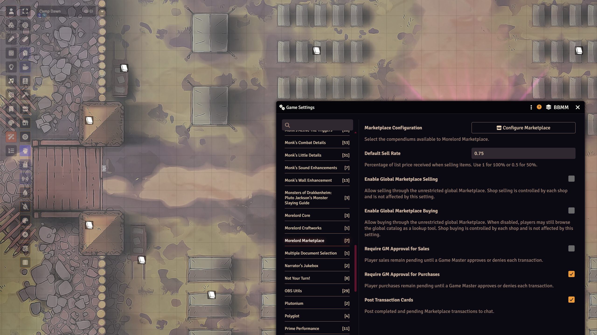
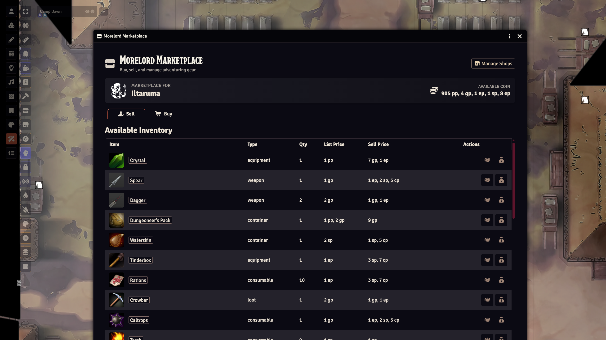
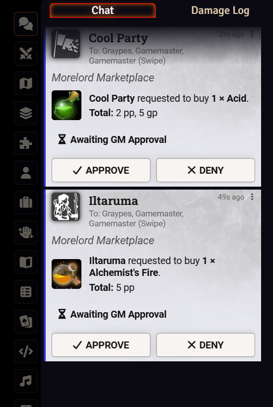
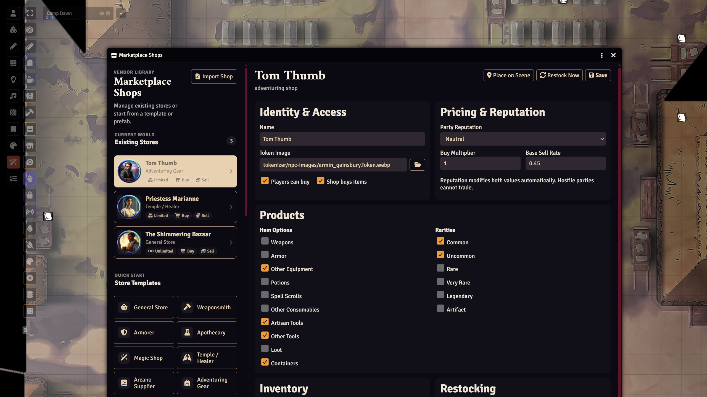
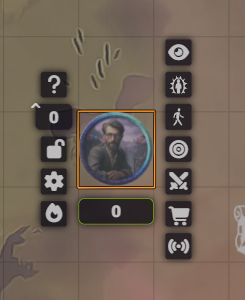
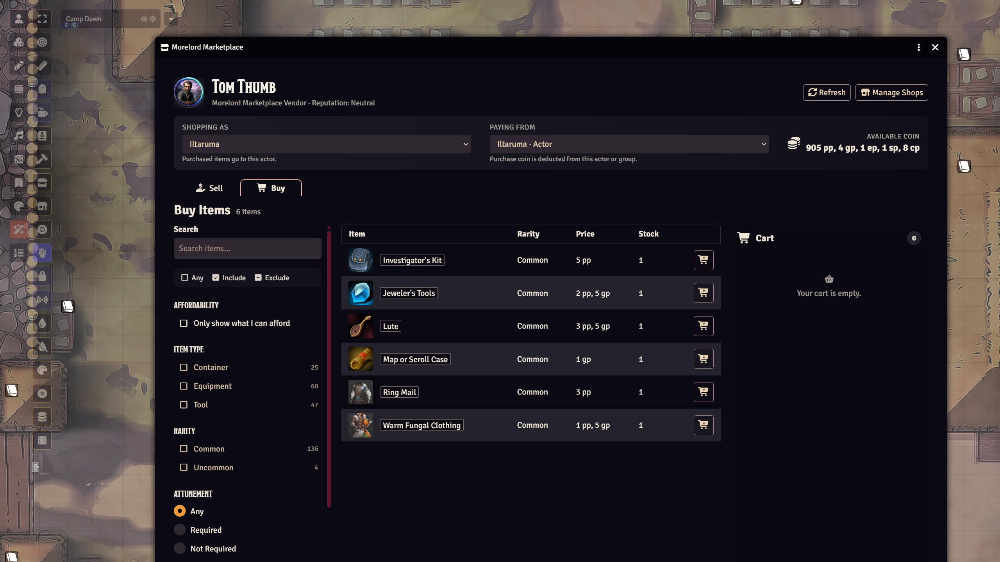
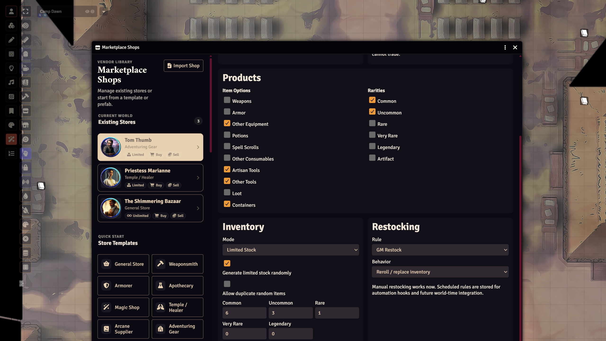
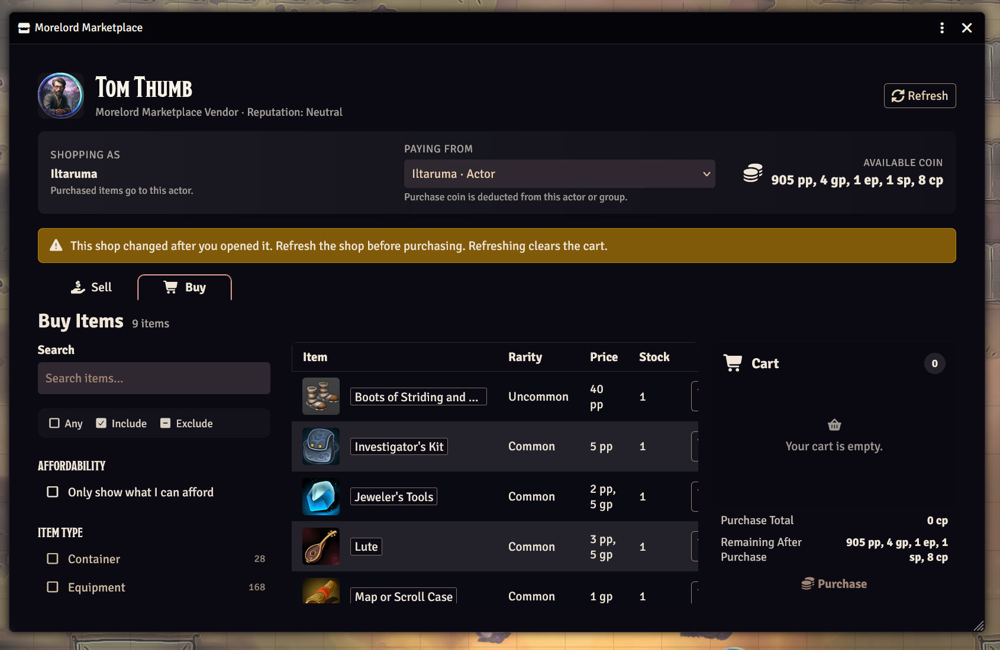

# Morelord Marketplace Game Master Manual

This guide covers Morelord Marketplace 0.10.2, Foundry VTT v14, dnd5e, and Morelord Core 0.4.2 or later. The global tabs run **Sell → Transfer → Buy → Wishlist**. Sell eligible inventory items at rates set by the GM; wishlists save desired items without reserving stock.

## Inventory transfers

The **Transfer** tab lets players move physical inventory quantities or whole stacks to another eligible character or Group, including inventories they cannot edit. An active, non-ignored GM client must be connected to apply transfers automatically through Core. Transfers require no approval or premium access, do not change currency, and post a transaction chat card. Containers include all their contents and nested containers, with containment preserved at the recipient. The player selects **Sender**, adds one item or a whole stack to the cart, adjusts quantities, selects **Recipient**, and chooses **Transfer Items**. A character source requires ownership; a Group source requires only membership through the player's assigned or owned character. Recipient edit permission is not required. Transfer the whole container stack to include its contents. Overlapping individual and container selections move each item only once. Individual contents can be sent separately. If inventory rollback is incomplete, review both actors before retrying.

Morelord Marketplace gives a Foundry VTT world a global catalog for buying and selling dnd5e items. With Tools Premium or Tools Champion access, it also provides GM transaction approvals and Shop Manager for configurable scene vendors.

This manual applies to Morelord Marketplace 0.10.1, Foundry VTT v14, and the dnd5e system.

## Contents

- [Inventory transfers](#inventory-transfers)
- [Feature access](#feature-access)
- [Install and activate](#install-and-activate)
- [Configure the global Marketplace](#configure-the-global-marketplace)
- [Open and test the Marketplace](#open-and-test-the-marketplace)
- [Manage GM approvals](#manage-gm-approvals)
- [Set up premium access](#set-up-premium-access)
- [Create and configure shops](#create-and-configure-shops)
- [Place and operate scene shops](#place-and-operate-scene-shops)
- [Manage stock and restocking](#manage-stock-and-restocking)
- [Import, export, and delete shops](#import-export-and-delete-shops)
- [Troubleshooting](#troubleshooting)

## Feature access

| Feature | Standard | Tools Premium / Champion |
| --- | :---: | :---: |
| Browse the global catalog | Yes | Yes |
| Buy and sell in the global Marketplace | Yes | Yes |
| Transfer inventory items with a connected GM | Yes | Yes |
| Save shopper wishlists | Yes | Yes |
| Configure allowed item compendiums | Yes | Yes |
| Configure the default buy and sell rates | Yes | Yes |
| Post transaction cards to chat | Yes | Yes |
| Require GM approval for global purchases and sales | No | Yes |
| Create and manage scene shops | No | Yes |
| Import, export, place, and restock shops | No | Yes |

The global Marketplace remains usable if premium access expires. Saved premium settings and shop data are retained, but premium controls remain locked until access returns.

## Install and activate

### Requirements

- Foundry Virtual Tabletop v14
- The dnd5e game system
- Morelord Core 0.4.0 or later
- Morelord Marketplace v0.10.1

### Install with the manifest

1. On Foundry's Setup screen, open **Add-on Modules**.
2. Select **Install Module**.
3. Paste this manifest URL into **Manifest URL**:

   `https://raw.githubusercontent.com/tmoreland72/morelord-marketplace/main/module.json`

4. Install the module.
5. Open the intended world and choose **Manage Modules**.
6. Enable **Morelord Core** and **Morelord Marketplace**.
7. Save module settings and reload when Foundry requests it.

## Configure the global Marketplace

Open **Game Settings → Configure Settings → Module Settings → Morelord Marketplace → Configure Marketplace**.

*The Marketplace world settings control global trading, approval requirements, transaction cards, and access to compendium configuration.*

### World settings

| Setting | Default | Effect |
| --- | --- | --- |
| **Default Buy Rate** | `1` | Multiplier of list price for global purchases, at least `1`. Enter `1.5` for 150%. Applies to catalog prices, checkout, and approvals; shops retain their own pricing. |
| **Default Sell Rate** | `1` | Fraction of an item's list price paid for global sales, from `0` to `1`. Enter `0.5` for 50% or `1` for 100%. Shops can override this value. |
| **Enable Global Marketplace Selling** | On | Enables selling in the global Marketplace. It does not affect shop-specific selling. |
| **Enable Global Marketplace Buying** | On | Enables direct global purchases. If off, players can still browse the catalog as a reference. It does not affect shop-specific buying. |
| **Require GM Approval for Sales** | Off | Holds player-initiated global sales for a GM decision. Premium or Champion access is required. |
| **Require GM Approval for Purchases** | Off | Holds player-initiated global purchases for a GM decision. Premium or Champion access is required. |
| **Post Transaction Cards** | On | Posts pending and completed Marketplace transactions to chat. |

GM-initiated global transactions do not wait for approval. Shop cart purchases are processed through the shop checkout workflow rather than the global approval settings.

The settings page is GM-only. Number inputs accept steps of `0.05`; buying requires at least `1`, while selling accepts `0` through `1`. **Save** persists the world settings; closing without Save discards unsaved edits. Changes apply to subsequent global transactions, not individual shops' stored rates.

| Account control or value | Explanation |
| --- | --- |
| **Morelord Account / Connected with** | Shows whether Core has an account connection and its current membership tier. |
| **GM Approval Workflow** | Shows whether the connected account grants Premium/Champion access to approvals. |
| **Access last checked** | Time Core last validated account access. |
| **Connect Account / Manage Account** | Opens Core's shared account connection and management window. |
| **Refresh** | Revalidates connected account access; does not change trading settings. |

### Choose catalog sources

Marketplace uses the D&D5e system's **Configure Sources** selection. Enable or disable Item compendiums there; Marketplace does not maintain a separate source list.

## Open and test the Marketplace

The player guide's **Marketplace field and action reference** covers all shared shopper, payer, transfer, filter, table, wishlist, and cart controls. Additional GM controls:

| Control | Explanation |
| --- | --- |
| **Manage Shops** | Opens the premium Shop Manager. |
| **Documentation** | Opens the appropriate Marketplace guide. |
| **Temporarily ignore buy and sell rates** | Uses list prices for global purchases and sales until cleared. Does not alter stored default rates or shop prices. |
| **Approve / Deny** on a pending transaction card | Resolves the player's pending request after current permissions, item availability, and prices are checked. Approval applies inventory/currency changes once; denial leaves them unchanged. |

*The global Marketplace shows the active character, available coin, Sell, Transfer, Buy, and Wishlist tabs, and—when available—the GM-only Manage Shops control. The screenshot predates the Transfer tab.*

1. Open a scene and select **Token Controls**.
2. Select the **Morelord Marketplace** store icon.
3. Select a character token or assign a user character before testing a transaction.
4. Open **Buy** and confirm that items from the enabled compendiums load.
5. Open **Sell** and confirm that priced, sellable inventory appears.

The Buy sidebar separates weapon class (Martial or Simple) from weapon range (Melee or Ranged), exposes weapon mastery filters when weapons are in scope, and preserves its scroll position after filter changes. Sell inventory is always alphabetical in global and shop views.

For the global Marketplace, the selected token's actor is used when the user owns it. Otherwise, Marketplace uses the character assigned to that user. GMs may operate an eligible selected actor directly.

## Manage GM approvals

Approvals apply only to player-initiated transactions in the unrestricted global Marketplace.

*A pending approval card identifies the requester, item, total, and current status before the GM approves or denies the transaction.*

### Enable approvals

1. Confirm that premium access is active.
2. Open the Morelord Marketplace module settings.
3. Enable **Require GM Approval for Purchases**, **Require GM Approval for Sales**, or both.
4. Keep **Post Transaction Cards** enabled so the approval controls appear in chat.

### Resolve a request

1. A player starts a purchase or sale.
2. Marketplace posts a pending transaction card to chat.
3. A GM selects **Approve** or **Deny**.
4. Marketplace validates the transaction again before completing it.
5. The chat card changes to **Approved**, **Denied**, or **Unable to Complete**.

Item names on Marketplace transaction and approval cards are Foundry document links when an item UUID is available. Sale cards prefer the item's original compendium source so links can remain valid after the final owned copy is sold.

Revalidation protects against changed currency, inventory, item prices, disabled settings, unavailable compendiums, and other world changes made while a request was pending.

## Set up premium access

Premium access is managed through Morelord Core.

1. Open **Configure Marketplace**.
2. In the premium-access panel, select **Connect Account** or **Manage Account**.
3. Complete the Morelord Gaming account connection through Morelord Core.
4. Return to Marketplace settings and select **Refresh Access** if necessary.

The panel reports the current tier and the most recent access check. Marketplace can continue using cached access during a temporary website outage. Disconnecting an account or losing entitlement locks the premium controls without deleting existing shop data.

## Create and configure shops

Shop Manager requires Tools Premium or Tools Champion access.

*Shop Manager combines existing vendors, quick-start templates, import controls, and detailed identity, pricing, product, inventory, and restocking settings.*

### Open Shop Manager

As a GM, use either method:

- Select **Manage Marketplace Shops** in Token Controls.
- Open Marketplace and select **Manage Shops**.

### Create from a store template

1. Click **New Shop** beside **Import Shop**.
2. In the popup, choose a Store Template and adjust its settings.
3. Click **Save New Shop** to create it and perform the initial restock.
4. The popup closes and the saved shop appears under **Existing Stores**. Closing without saving discards the draft.

Templates provide starting product categories, rarities, and price multipliers. They do not prevent later customization.

### Create from a prefab store

Prefab stores use curated definitions from the Shop Compendium.

1. Enable relevant Player's Handbook, Dungeon Master's Guide, SRD 5.1, or SRD 5.2 Item compendiums.
2. Open Shop Manager.
3. Click **New Shop**, choose a prefab under **Prefab Stores**, adjust its settings, and click **Save New Shop**.

A prefab appears only when at least eight of its listed products match supported, enabled compendiums. Prefab shops use their matched product list as unlimited inventory.

### Identity and access

| Control | Effect |
| --- | --- |
| **Name** | Sets the shop, generated actor, prototype token, and placed-token name. |
| **Token Image** | Sets the generated actor and token artwork. Use the folder button to browse Foundry files. |
| **Players can buy** | Enables the shop's Buy workflow independently of global buying. |
| **Player can sell** | Enables selling to this shop independently of global selling. |

### Pricing and reputation

The final purchase price is the item price multiplied by the shop's **Buy Multiplier**, then by the reputation modifier. The final sale price uses the shop's **Base Sell Rate**, then the reputation modifier.

| Reputation | Purchase-price multiplier | Sale-payout multiplier |
| --- | ---: | ---: |
| Hostile | No trade | No trade |
| Unfriendly | 1.25 | 0.70 |
| Neutral | 1.00 | 1.00 |
| Friendly | 0.90 | 1.20 |
| Honored | 0.80 | 1.40 |

Example: a shop with a `1.10` Buy Multiplier and Friendly reputation sells a 100 gp item for 99 gp: `100 × 1.10 × 0.90`.

### Product filters

Choose any combination of:

- Weapons
- Armor
- Other Equipment
- Potions
- Spell Scrolls
- Other Consumables
- Artisan Tools
- Other Tools
- Loot
- Containers

Then select permitted rarities: Common, Uncommon, Rare, Very Rare, Legendary, or Artifact. Product and rarity settings affect the shop's catalog and random stock. Item Options control accepted player sales unless a specific purchase list is configured.

### Stock Plan

| Mode | Behavior |
| --- | --- |
| **Manually added items only** | Restock restores configured manual quantities without random additions. |
| **Unlimited catalog** | Eligible catalog products are unlimited; remaining manual stock is preserved. |
| **Random stock** | Restock selects limited products by rarity, replaces generated stock, and preserves remaining manual stock. |
| **Unlimited common + random rarer stock** | Common products are unlimited; restock randomizes uncommon and rarer stock and preserves manual stock. |

Existing shops with generation disabled show **Keep existing stock (previous setup)**; restocking leaves quantities unchanged. Legacy top-up shops retain generated listings not selected this time. Existing stored settings and stock targets are preserved. Shop Manager contains no helper paragraphs; this guide explains the fields and plans.

## Place and operate scene shops

### Shop Manager field reference

These fields are the same in the saved-shop editor and the New Shop popup. Explanations live here instead of beneath the controls.

| Field | Explanation |
| --- | --- |
| **Name** | Shop name used by its actor and tokens. |
| **Token Image** | Image path for the shop actor and token. The folder button opens Foundry's file browser. |
| **Players can buy** | Allows purchases from this shop. |
| **Player can sell** | Allows player inventory sales to this shop. |
| **Party Reputation** | Adjusts purchase prices and sale payouts using the reputation table above. Hostile disables trading. |
| **Buy Multiplier** | Multiplies the item's list price before the reputation adjustment. New shops initially use the global purchase multiplier. |
| **Base Sell Rate** | Fraction of list price paid for player sales before reputation adjustment. New shops initially use the global sale rate. |
| **Morelord Location** | Optional association with Core's shared Location registry. The Location's Marketplace capability supplies the rarity limit when inherited; assigning a Location does not place a token. |
| **Maximum Normal Rarity** | Limits generated catalog items and random restocks to the chosen rarity or lower. An explicit shop tier overrides its Location; Inherit from Location uses that Location's Marketplace capability. Without either limit, Products rarity selections apply. Manual additions may exceed the capability limit; prefab stores retain their matched product lists. |
| **Stock Plan** | Controls unlimited, manual, or random inventory and what Restock Now does. Every option is explained in the Stock Plan table above, including the legacy Keep existing stock option. |
| **Common** | Number of distinct Common products selected for random stock. Hidden and unused when common products are unlimited. |
| **Uncommon** | Number of distinct Uncommon products selected for random stock. |
| **Rare** | Number of distinct Rare products selected for random stock. |
| **Very Rare** | Number of distinct Very Rare products selected for random stock. |
| **Legendary** | Number of distinct Legendary products selected for random stock. |
| **Exclude magical items** | Excludes products with the Magical property from shop inventory and restocking, including manual and prefab products. Does not restrict player sales to the shop. |
| **Exclusively magical items** | Requires the Magical property for inventory and restocks, including manual and prefab products. Mutually exclusive with Exclude magical items; does not restrict player sales. |
| **Item Options** | Selects permitted product categories: Weapons, Armor, Other Equipment, Potions, Spell Scrolls, Other Consumables, Artisan Tools, Other Tools, Loot, and Containers. Filters normal stock and accepted player sales unless a specific purchase list is configured. |
| **Rarities** | Common, Uncommon, Rare, Very Rare, Legendary, and Artifact filters narrow normal stock alongside the capability limit. |
| **Items the shop will buy** | Explicit accepted-product list. A nonempty list restricts player sales to matching items; an empty list uses Item Options. Player can sell must also be enabled. Independent of inventory sold by the shop. |
| **Current Inventory quantities** | Plus and minus change finite stock. For manual items, changes also set the quantity restored by the manual-only plan. Purchases reduce remaining stock without changing that target. Unlimited listings have no quantity controls. |

Random counts are nonnegative; zero selects no products at that rarity. Selection always chooses distinct products and stops when the eligible pool is exhausted. Product filters, magical policy, capability, and removed-item exclusions determine eligibility. Unit quantities are randomized separately using the table in Random inventory.

| Action or displayed value | Explanation |
| --- | --- |
| **Documentation** | Opens this guide. |
| **New Shop** | Opens an unsaved draft with the full settings, Store Templates, and Prefab Stores. Closing without saving creates no store. |
| **Store Templates** | Initializes the draft with a chosen shop type's defaults. Changing the template replaces the unsaved draft. |
| **Prefab Stores** | Initializes a draft from a curated matched product list. A prefab appears only with at least eight matches in enabled supported PHB, DMG, SRD 5.1, or SRD 5.2 compendiums. |
| **Existing Stores** | Selects a saved shop for editing; the count shows saved shops in this world. |
| **Save / Save New Shop** | Saves settings. Saving a draft adds it to Existing Stores and closes the popup; initial inventory is generated according to the plan. |
| **Place on Scene** | Creates the linked vendor token on the current scene. Available after the shop is saved. |
| **Restock Now** | Saves current visible settings, then applies the selected plan. Removed products remain excluded. Manual stock is replenished only by the manual-only plan. |
| **Add Item** | Opens Core's searchable item-picker popup for the purchase list or inventory. Requires a saved shop; inventory additions must satisfy the magical policy. |
| **Item name / artwork / source details** | Identifies a listing; the name opens its source item. Source, rarity, and type describe the matched catalog product. |
| **Manual badge** | Marks GM-managed inventory. Capability limits may be exceeded; applicable magical policy is still enforced. |
| **Unlimited badge** | This product has no finite stock limit. |
| **List count badges** | Number of configured purchase products or currently displayed inventory listings. |
| **Remove item** | Removes a purchase-list restriction or excludes an inventory listing from future restocks. |
| **Import Shop** | Imports a portable definition into this world. See the import steps below. |
| **Export Shop** | Downloads the selected portable definition without world actor/token references. |
| **Delete Shop** | Deletes the definition, generated shop actor, and associated tokens after confirmation. Export first to retain a copy. |

Examples: an Uncommon capability permits Common and Uncommon normal products, but excludes Rare and higher; a manually added Rare item is the capability exception. A Common product count of three selects up to three distinct eligible products, each receiving 1–6 units. Repeating Restock Now rerolls those products in the Random stock plan; it restores configured manual quantities in the manual-only plan.

1. Select a shop in Shop Manager.
2. Select **Save** after making configuration changes.
3. Open the scene where the vendor should appear.
4. Select **Place on Scene**.
5. Move the new token from the center of the scene to its intended location.

Marketplace creates a linked shop actor with Observer access for players. A player opens the shop by double-clicking its token. Users who can open the token's HUD—normally a GM—also receive a Marketplace cart control there.

*The Marketplace cart button appears in the Token HUD for GMs and other users allowed to open that HUD. Players normally open the same vendor by double-clicking its token.*

Opening the generated shop actor also redirects to the Marketplace shop interface instead of showing an NPC sheet.

Within a shop, **Shopping As** controls which character or Group receives purchased items. **Paying From** controls which character or Group supplies the coins. Character inventories require Owner permission. A Group requires only membership through the player's assigned or owned character; no Group Owner grant is needed. A connected GM applies restricted Group mutations after validating membership. Group actors are listed first as eligible funding sources.

*A vendor keeps the receiving character and payment source explicit while showing current reputation, funds, stock, and cart state.*

## Manage stock and restocking

*Older screenshots show the previous inventory controls. The current editor uses Stock Plan and distinct product counts, without repeat-selection or separate Restocking controls.*

### Random inventory

Choose a random Stock Plan, then set **Different products per rarity**. Counts select distinct products up to the eligible pool size, rather than units. Common counts are unused with unlimited common stock. Each selected listing receives a random quantity:

| Rarity | Units per selected listing |
| --- | ---: |
| Common | 1–6 |
| Uncommon | 1–4 |
| Rare | 1–2 |
| Very Rare | 1 |
| Legendary | 1 |

Selections always choose distinct products. If fewer eligible products exist than the configured count, all available products are selected once. Legacy repeat-selection settings are ignored; existing inventory remains intact.

### Manual restocking

Select **Restock Now** to save the visible settings and apply the Stock Plan. New random shops replace generated stock; existing replacement/top-up metadata remains intact. Manual stock is preserved except in the manual-only plan, which restores configured quantities. Restocking advances the revision, so older open shops must be refreshed before purchase.

### Carts, reservations, and stale shops

*A stale shop disables the old transaction state and directs the shopper to Refresh, which reloads current data and clears the cart.*

Adding a limited item to a cart temporarily reserves it for that user's active shop session. Other shoppers see the reduced unreserved availability. Closing the shop or clearing the cart releases its reservations.

Stock changes and saved configuration changes advance the shop revision. If a shop changes while someone is browsing, Marketplace displays a stale-shop warning. The shopper must select **Refresh**, which clears the cart and reloads current prices and stock.

Checkout validates actor access, funds, enabled compendiums, current prices, product filters, stock, reservations, and shop revision. A failed checkout reports an error and is designed not to keep partial changes.

## Import, export, and delete shops

### Export

1. Select the shop in Shop Manager.
2. Select **Export Shop**.
3. Store the downloaded `morelord-marketplace-shop-*.json` file safely.

Exports contain the portable shop definition but omit the world-specific actor and token UUIDs.

### Import

1. Select **Import Shop**.
2. Choose a Marketplace shop JSON file.
3. Review the imported shop and select **Save** if you make changes.
4. Use **Place on Scene** to create its actor and token in the destination world.

An imported shop receives a new internal ID, a new revision, and no pre-existing actor or scene-token links.

### Delete

1. Select the shop.
2. Select **Delete Shop**.
3. Confirm the warning.

Deleting a shop removes its shop definition, generated shop actor, and associated scene tokens. Export first if you may need the configuration later.

## Troubleshooting

### No items appear in Buy

- Open **Configure Marketplace** and enable at least one Item compendium.
- Confirm the source compendium is available and not disabled.
- Clear active filters in the Buy sidebar.
- For a shop, confirm its product options and rarities match the intended items.
- For limited or hybrid inventory, select **Restock Now**.

### A prefab store does not appear

- Enable supported PHB, DMG, SRD 5.1, or SRD 5.2 Item compendiums.
- Confirm at least eight items from the prefab definition can be matched.
- Reopen Shop Manager after changing compendium selection.

### Premium controls are locked

- Confirm Morelord Core is enabled.
- Use **Connect Account** or **Manage Account** in Configure Marketplace.
- Select **Refresh Access**.
- Confirm the connected account includes Tools Premium or Tools Champion access.

### A player cannot transact

- Assign the user a character or grant Owner permission to an eligible character.
- For shops, verify both **Shopping As** and **Paying From** have eligible actors.
- Confirm the funding actor has a dnd5e currency record and enough coin.
- Confirm global or shop-specific buying/selling is enabled.
- Check reputation; Hostile parties cannot trade.

### A shop says it changed

Another checkout, restock, or shop edit advanced the shop revision. Select **Refresh** and rebuild the cart from current stock.

### A sale item is missing

Marketplace lists supported sellable item types with a positive price. Items flagged as unsellable, priced at zero, or outside the shop's product filters are omitted.

## Support

Report reproducible problems at [Morelord Marketplace Issues](https://github.com/tmoreland72/morelord-marketplace/issues). Include the Marketplace version, Foundry version, dnd5e version, relevant console error, and steps to reproduce the problem.

## Current catalog and shop controls

Global Buy and Sell both use carts. Adding items only prepares a transaction; Purchase or Sell Cart submits it. When global GM approval is enabled, the complete cart is one request and current prices, funds, availability, and quantities are revalidated before commitment. Buy results are paginated at 50 items per page while filters cover the entire catalog.

Shop Manager can associate a shop with a shared Core Location. Normal stock can inherit its capability tier or use the shop's maximum normal rarity override. Manually included inventory may exceed that limit; its Manual badge identifies manually managed stock. Normal restocking preserves remaining quantity; manual-only shops restore configured quantities.

Eligible wishlist items receive a 1.25x selection weight during random restocking. They are not guaranteed picks, whether duplicate selection is enabled or disabled. The rarity counts still control the number of draws, and the documented unit ranges apply to selected listings.

Use the shared Manage Locations action to edit Core Locations. Shopping As and Paying As remain separate choices, now with Core character portraits. Page and tab scroll positions are retained while browsing and updating carts.

## D&D 5e rarity compatibility

Catalogs and shops accept legacy rarity fields and v6 rarity collections. Items with multiple rarities use the lowest listed rarity for classification and shop limits, matching the system single-rarity Item getter. An empty rarity collection is mundane; nonmagical items retain their existing Common catalog grouping.

## Global rate override and shop defaults

The GM’s **Temporarily ignore buy and sell rates (both ×1)** toggle applies list prices to global purchases and sales for everyone. Switch it off to resume the unchanged configured rates. It persists across reloads, leaves shop pricing alone, and clears global carts when changed. New shops copy the configured buy/sell rates; their values remain editable.

Prefab choices show one entry per normalized shop name, keeping the variant with the most available matches. Previously saved prefab IDs remain resolvable. SRD items copied into other packs still honor their canonical D&D5e source exclusions.

## Manually configured shop items

**Player can sell** enables selling to the vendor. Under **Items the shop will buy**, use **Add Item** to search enabled Item compendiums. Once this list contains an item, it is exclusive: the Sell tab shows only matching owned items, and checkout checks the current list again. Removing the last entry restores the shop's normal Item Options filtering. This list is independent of inventory offered for sale.

Items match their compendium origin (including renamed copies). Items without a recorded origin match by name and item type; copies from a different compendium origin require their own entry. Usual supported-type, positive-price, unsellable-flag, and reputation restrictions still apply.

Choose **Manually added items only** under Stock Plan to offer only manual inventory. **Restock Now** restores configured quantities without selecting more products. Adding or adjusting a listing sets its restock quantity; purchases leave that target unchanged. Sold-out manual listings remain visible to the GM. Existing listings without a target use their remaining quantity, or one if sold out, on their first manual-only restock.

Older shops with generation disabled show **Keep existing stock (previous setup)**. This does not remove existing generated stock, restrict catalog products to manual additions, or replenish manual stock. Choose another plan to change that behavior.

**Common** includes both mundane items (no rarity) and common magic items. It is not a mundane-only filter. Enable **Exclude magical items** under Products to reject the D&D5e Magical (`mgc`) property regardless of rarity. This also filters manually added and prefab listings, restock candidates, and checkout. The option defaults to off and does not alter the purchase list or player-selling rules. It depends on items having their Magical property correctly set.

The purchase list and Current Inventory use the same Core section headings, count badges, Add Item actions, and item rows. Both show item artwork, a document link, available source details, and removal controls; inventory also has stock quantity controls.

Both **Add Item** actions open Core's separate item-picker popup. Search enabled compendiums and select a result to add it to inventory or the purchase list.

**Exclusively magical items** allows only products with the Magical (`mgc`) property, including manual and prefab listings and restocks. It is mutually exclusive with **Exclude magical items**. Neither policy changes player selling rules. Rarity alone does not establish that a product is magical.

Buy and Sell begin with **Shopper and Payer**, with portraits inside Core selectors. Global Transfer uses **Sender and Recipient** above inventory, without a recipient control in the cart. Wishlist uses the previously selected shopper without showing that section. Shops offer Buy and Sell only. All carts use matching Core components. Existing screenshots show the previous layout.

Unpriced source items receive a rarity-based base price: Common 100 gp, Uncommon 400 gp, Rare 4,000 gp, Very Rare 40,000 gp, and Legendary 200,000 gp. Blank/mundane rarity uses Common; artifacts and unknown rarities need an explicit price. Positive source prices and GM custom prices take priority. Normal buy/sell rates apply, and compendium data is unchanged.
