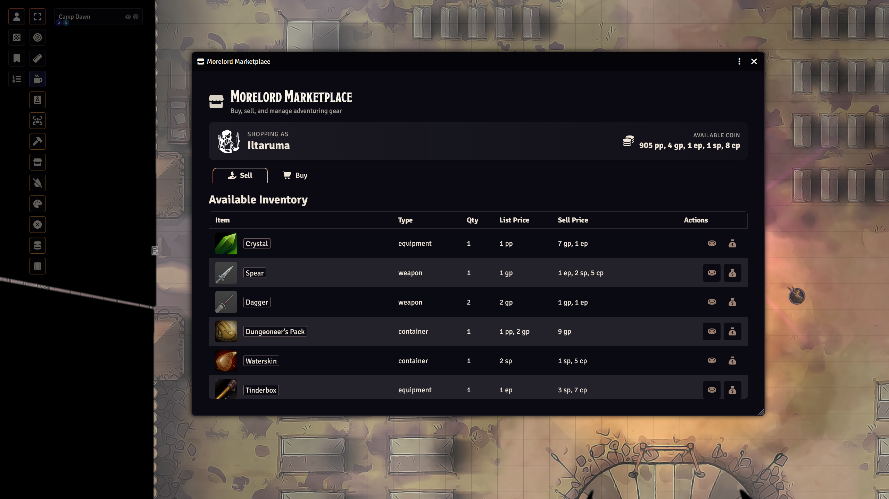
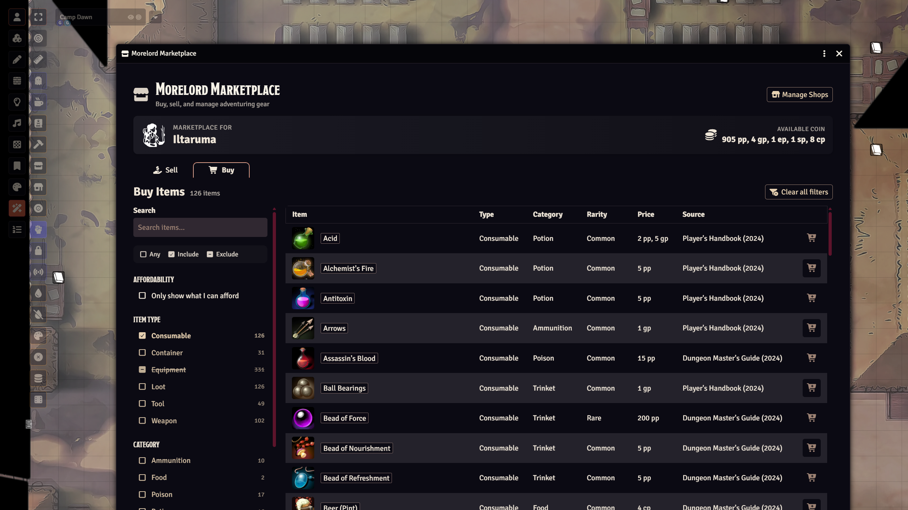
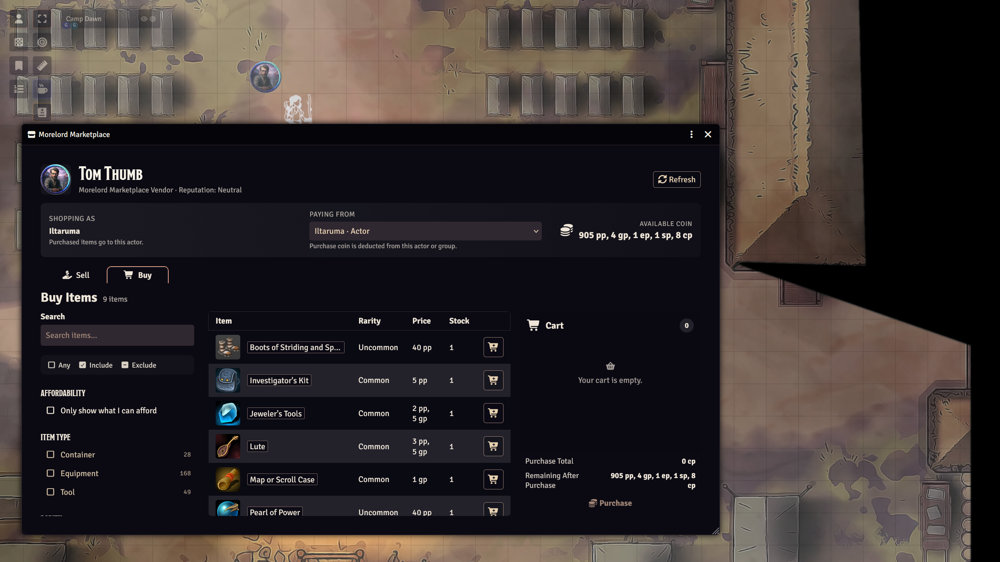
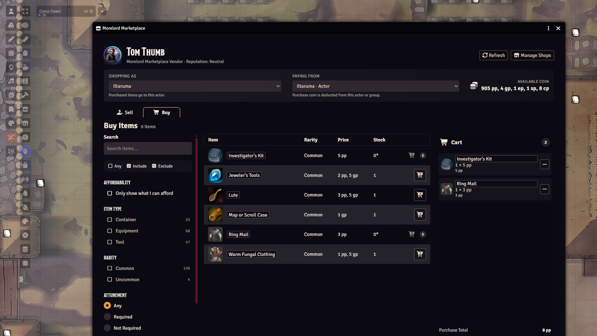
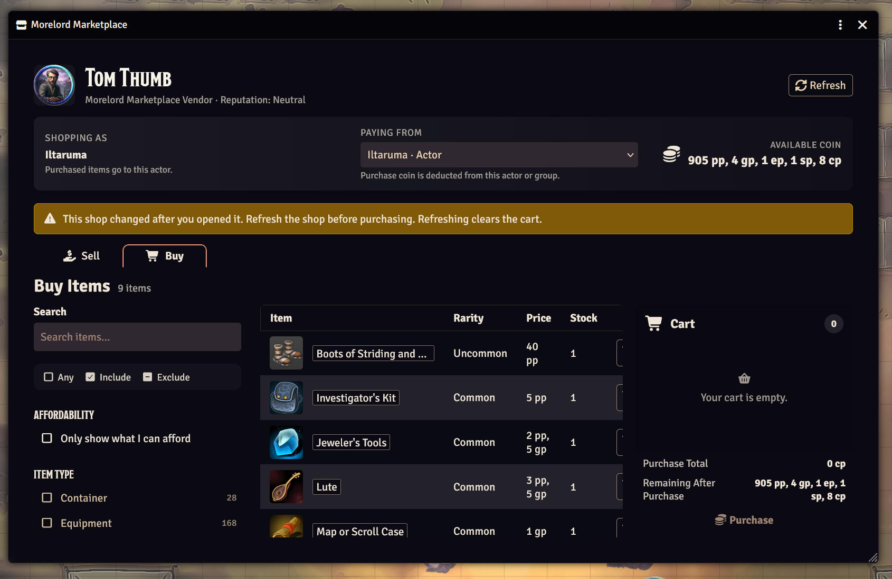
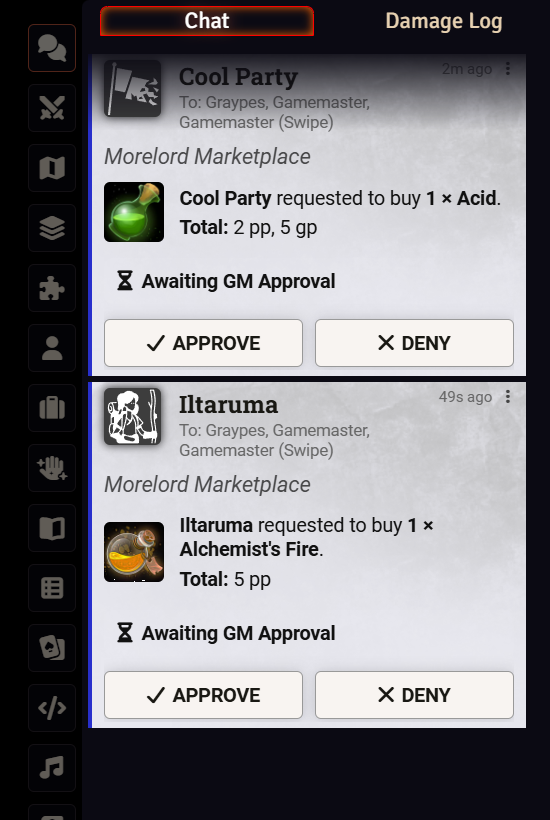

# Morelord Marketplace Player Manual

Morelord Marketplace lets you browse, buy, and sell dnd5e items from your character in Foundry VTT. Your GM may also place individual vendors with their own products, prices, reputation, and stock.

This manual applies to Morelord Marketplace 0.5.2.

## Contents

- [Before you shop](#before-you-shop)
- [Open the global Marketplace](#open-the-global-marketplace)
- [Browse and filter items](#browse-and-filter-items)
- [Buy from the global Marketplace](#buy-from-the-global-marketplace)
- [Sell from your inventory](#sell-from-your-inventory)
- [Use a scene shop](#use-a-scene-shop)
- [Understand approvals and chat cards](#understand-approvals-and-chat-cards)
- [Troubleshooting](#troubleshooting)

## Before you shop

You need a character actor that you own. The Marketplace chooses your actor in this order:

1. The actor belonging to your selected token, if you have Owner permission.
2. The character assigned to your Foundry user.

Select your character token before opening the global Marketplace when you want to be certain which character is used.

Your character needs enough dnd5e currency to purchase an item. The Marketplace automatically converts denominations when checking funds and applying a transaction.

## Open the global Marketplace

*The player Marketplace identifies the active character, shows available coin, and provides separate Buy and Sell tabs without GM-only controls.*

1. Open **Token Controls** on the left side of the scene.
2. Select the **Morelord Marketplace** store icon.
3. Confirm that the character shown near the top of the window is the character you intend to use.

The global Marketplace contains two tabs:

- **Buy** displays the item catalog selected by your GM.
- **Sell** displays eligible items in your character's inventory.

Your GM can disable global buying or selling independently. If buying is disabled, you may still browse the Buy catalog as a reference.

## Browse and filter items

Open the **Buy** tab. The item count updates as you filter the catalog.

*Combine search, affordability, price, and tri-state facets to narrow the catalog; this example includes Consumables and excludes Equipment.*

### Search and price

- Enter part of an item name in **Search**.
- Enter minimum or maximum values under **Price (gp)**.
- Enable **Only show what I can afford** to compare prices with your available coins.

### Catalog facets

Depending on the available items, you can filter by:

- Item Type
- Category
- Weapon Properties
- Rarity
- Attunement
- Source

Item Type, Category, Weapon Properties, Rarity, and Source use three states:

| Symbol | State | Meaning |
| --- | --- | --- |
| Empty square | Any | Do not filter on this value. |
| Checked square | Include | Show items matching the selected value. |
| Minus square | Exclude | Hide items matching the selected value. |

Select a facet repeatedly to cycle through Any, Include, and Exclude. Select **Clear all filters** to reset the complete sidebar.

Select an item's linked name to open its source compendium entry and read its full description.

## Buy from the global Marketplace

1. Confirm the correct character is shown.
2. Open **Buy**.
3. Find the item you want.
4. Select its cart-plus button.

If the transaction completes immediately, Marketplace deducts the price from the character and adds the item to that character's inventory. If GM approval is enabled, the request remains pending until a GM approves or denies it.

The purchase button may be unavailable when global buying is disabled. Marketplace also prevents a purchase when the character cannot afford the current price or the source item is no longer available.

## Sell from your inventory

1. Confirm the correct character is shown.
2. Open **Sell**.
3. Review each item's quantity, list price, and offered sell price.
4. Select the coin button to **Sell One**, or the sack button to **Sell All**.

When the sale completes, Marketplace removes the sold quantity and deposits the proceeds into the character's currency. If GM approval is enabled, the item and payment remain unchanged until the GM approves the request.

Only supported, priced items appear. An item may be absent if it has no positive price, is marked unsellable, or is not accepted by the current shop.

## Use a scene shop

Scene shops are individual vendors configured by your GM. They can have unique products, prices, stock, reputation, and buying or selling rules.

### Open a shop

Double-click the shop token. Shop tokens grant players Observer access, so the standard Token HUD is normally unavailable to players.

### Choose the shopper and funding actor

*The player shop keeps the receiving character, payment source, available coin, stock, cart totals, remaining funds, and Purchase state visible without GM-only controls.*

At the top of a shop, review:

- **Shopping As** — the character that receives purchased items and whose inventory is shown when selling.
- **Paying From** — the owned character or Group actor whose coins pay for purchases.

These may be different. For example, your character can receive an item while a shared party Group actor pays. You must have Owner permission for any actor you operate.

### Buy with the shop cart

*Cart lines show reserved quantities and line totals while the catalog reflects the remaining unreserved stock.*

1. Choose **Shopping As** and **Paying From**.
2. Open **Buy**.
3. Select an item's cart-plus button once for each unit you want.
4. Review the cart's quantities, total, and remaining currency.
5. Use the minus button to remove one unit, or **Clear Cart** to start over.
6. Select **Purchase**.

Limited items are reserved while they remain in an active cart. Other shoppers may therefore see fewer unreserved units. Closing the shop or clearing your cart releases your reservations.

Checkout rechecks your actor permissions, funds, prices, stock, and the shop's current configuration. If it fails, read the notification, refresh when appropriate, and try again.

### Sell to a shop

1. Confirm **Shopping As** is the character whose item you want to sell.
2. Open **Sell**.
3. Review the shop's offer.
4. Choose **Sell One** or **Sell All**.

Shop offers can differ from the global Marketplace because each vendor has its own sell rate and reputation adjustment. A shop may also accept only certain product categories or may not buy items at all.

### Reputation

The shop header displays the party's current reputation. Reputation can affect both purchase prices and sale offers:

- **Unfriendly** usually makes purchases cost more and sale offers lower.
- **Neutral** applies the shop's base rates.
- **Friendly** or **Honored** improves prices in the party's favor.
- **Hostile** prevents trading.

Your GM controls the reputation assigned to each shop.

### Refresh a changed shop

*When a shop changes after opening, use Refresh before purchasing; the previous cart is cleared.*

If another shopper checks out, the GM restocks, or the GM edits the shop, your open view may become stale. Marketplace displays a warning and prevents the old transaction.

Select **Refresh** to load current stock and prices. Refreshing clears your cart, so review and add the items again afterward.

## Understand approvals and chat cards

Your GM may require approval for player purchases or sales in the global Marketplace.

*Pending chat cards show the requested item and total while the transaction waits for a GM decision.*

When approval is required:

1. You submit the transaction.
2. A chat card shows **Awaiting GM Approval**.
3. A GM selects **Approve** or **Deny**.
4. The card changes to show the result.

Marketplace validates the transaction again during approval. An approved request can still report **Unable to Complete** if your currency, inventory, item price, source compendium, or Marketplace settings changed while it was waiting.

Completed transaction cards may also be posted to chat when the GM enables that setting.

## Troubleshooting

### “Select a character token” or “No character selected”

- Select a token linked to a character you own.
- Ask the GM to assign your Foundry user a character.
- Ask the GM to verify that you have Owner permission for the character.

### No funding actor is available

- Confirm your character has a dnd5e currency section.
- Ask the GM to grant you Owner permission for the intended character or party Group actor.
- Reopen the shop after permissions change.

### The Buy list is empty

- Select **Clear all filters**.
- Clear the Search field and price range.
- Ask the GM whether the intended compendium is enabled.
- In a scene shop, the current products may be out of stock or excluded by that vendor.

### The purchase button is disabled

- Global or shop buying may be disabled.
- The item may be out of unreserved stock.
- Select valid Shopping As and Paying From actors.
- Confirm the funding actor has enough coin.
- Refresh the shop if it changed.

### An item cannot be added to the cart

The item may already be fully reserved by you or other shoppers, or adding it would exceed the funding actor's available currency.

### A sale item is not listed

The item may have no price, be unsellable, use an unsupported item type, or fall outside the shop's accepted product categories.

### The shop says it changed

Select **Refresh**. Marketplace clears the old cart and reloads current shop stock, prices, and configuration.

### A pending transaction failed after approval

The transaction no longer matched the world state when the GM approved it. Check currency and inventory, reopen or refresh Marketplace, and submit a new request.

## Getting help

Ask your GM first for world-specific questions about enabled compendiums, prices, permissions, shops, and approvals. Reproducible module problems can be reported at [Morelord Marketplace Issues](https://github.com/tmoreland72/morelord-marketplace/issues).
